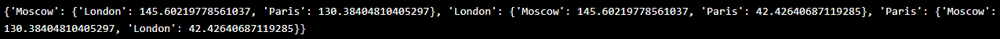
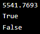
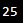
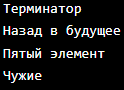
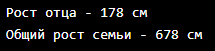
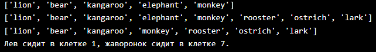
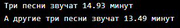
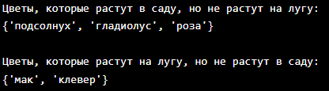
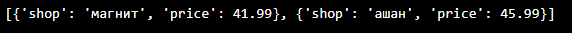
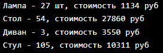

# 1 ЗАДАНИЕ 
Вычислить расстояние между 3 городами с помощью данной в задании формуле.
## Решение: 
```Python
#!/usr/bin/env python3
# -*- coding: utf-8 -*-
sites = {
    'Moscow': (550, 370),
    'London': (510, 510),
    'Paris': (480, 480),
}
distances = {}
def calculate_distance(coord1, coord2):
    return ((coord1[0] - coord2[0]) ** 2 + (coord1[1] - coord2[1]) ** 2) ** 0.5
for city1, coord1 in sites.items():
    distances[city1] = {}
    for city2, coord2 in sites.items():
        if city1 != city2:  
            distance = calculate_distance(coord1, coord2)
            distances[city1][city2] = distance

print(distances)
```
## Объяснение: 
C помощью отдельной функции вычисляем расстояние между городами так, чтобы не высчитывалось расстояние между одинаковыми городами, после чего это расстояние заносится в список. После всего этого список выводится.
## Ответ: 



# 2 ЗАДАНИЕ 
Находиться ли точка в площади окружности.
## Решение: 
Вычисляем площадь круга с помощью данного кода и выводим с тончость до 4 знака после запятой.
```Python
pi = 3.1415926
area = pi * (radius ** 2)
print(round(area, 4))
```
Определяем рассттояние от точки, до начала координат и проверяем, находиться ли точка в радиусе круга.
```Python
distance_1 = (point_1[0] ** 2 + point_1[1] ** 2) ** 0.5
is_inside_1 = distance_1 <= radius
print(is_inside_1)
```
## Ответ:


# 3 ЗАДАНИЕ 
Расставить знаки +, -, * и скобки в выражении 1 ? 2 ? 3 ? 4 ? 5, так чтобы получилось 25.
## Решение: 
Методом тыка получаем следующее выражение:
```Python
result = ((1 + 2)* 3 - 4) * 5
print(result)
```
## Ответ:
 
# 4 ЗАДАНИЕ 
Выведите на консоль с помощью индексации строки, последовательно:
первый фильм
последний
второй 
второй с конца
## Решение: 
Используя срезы получаем следующее:
```Python
my_favorite_movies = 'Терминатор, Пятый элемент, Аватар, Чужие, Назад в будущее'
print(my_favorite_movies[:10])  # 'Терминатор' Первый фильм
print(my_favorite_movies[-15:]) # 'Назад в будущее' Последний Фильм
print(my_favorite_movies[12:25])   # 'Пятый элемент' Второй Фильм
print(my_favorite_movies[-22:-17]) # 'Чужие' Второй с конца
```
## Ответ:
 

# 5 ЗАДАНИЕ 
Выведите на консоль рост отца в формате. Выведите на консоль общий рост вашей семьи как сумму ростов всех членов.
## Решение: 
Используя работу со списками получаем следующее:
```Python
my_family_height = [
    # ['имя', рост],
    ['Мама', 165],
    ['Дед', 175],
    ['Бабушка', 160],
    ['Отец', 178]
]

print(f'Рост отца - {my_family_height[3][1]} см')

obshiy = my_family_height[0][1] + my_family_height[1][1] + my_family_height[2][1] + my_family_height[3][1]
print(f'Общий рост семьи - {obshiy} см')
```
## Ответ: 


# 6 ЗАДАНИЕ 
Удаление, добавление, изменение массивов.
## Решение: 
Используя методы списков получаем следующее:
```Python
zoo = ['lion', 'kangaroo', 'elephant', 'monkey', ]
zoo.insert(1, 'bear')
print(zoo)
birds = ['rooster', 'ostrich', 'lark']
zoo.extend(birds)
print(zoo)
zoo.remove('elephant')
print(zoo)
lion_index = zoo.index('lion') + 1 
lark_index = zoo.index('lark') + 1 
print(f'Лев сидит в клетке {lion_index}, жаворонок сидит в клетке {lark_index}.')
```
## Ответ:


# 7 ЗАДАНИЕ 
Посчитать продолжительность треков, до 2 знаков после запятой.
## Решение: 
Используя методы списков и массивов получаем следующее:
```Python
violator_songs_list = [
    ['World in My Eyes', 4.86],
    ['Sweetest Perfection', 4.43],
    ['Personal Jesus', 4.56],
    ['Halo', 4.9],
    ['Waiting for the Night', 6.07],
    ['Enjoy the Silence', 4.20],
    ['Policy of Truth', 4.76],
    ['Blue Dress', 4.29],
    ['Clean', 5.83],
]
time_halo = next(song[1] for song in violator_songs_list if song[0] == 'Halo')
time_enjoy = next(song[1] for song in violator_songs_list if song[0] == 'Enjoy the Silence')
time_clean = next(song[1] for song in violator_songs_list if song[0] == 'Clean')
total_time_list = round(time_halo + time_enjoy + time_clean, 2)
print(f'Три песни звучат {total_time_list} минут')
violator_songs_dict = {
    'World in My Eyes': 4.76,
    'Sweetest Perfection': 4.43,
    'Personal Jesus': 4.56,
    'Halo': 4.30,
    'Waiting for the Night': 6.07,
    'Enjoy the Silence': 4.6,
    'Policy of Truth': 4.88,
    'Blue Dress': 4.18,
    'Clean': 5.68,
}
time_sweetest = violator_songs_dict['Sweetest Perfection']
time_policy = violator_songs_dict['Policy of Truth']
time_blue = violator_songs_dict['Blue Dress']
total_time_dict = round(time_sweetest + time_policy + time_blue, 2)
print(f'А другие три песни звучат {total_time_dict} минут')
```
## Ответ:


# 8 ЗАДАНИЕ 
Расшифровать сообщение
## Решение: 
Используя срезы и работу со списками получаем следующее:
```Python
secret_message = [
    'квевтфпп6щ3стмзалтнмаршгб5длгуча',
    'дьсеы6лц2бане4т64ь4б3ущея6втщл6б',
    'т3пплвце1н3и2кд4лы12чф1ап3бкычаь',
    'ьд5фму3ежородт9г686буиимыкучшсал',
    'бсц59мегщ2лятьаьгенедыв9фк9ехб1а',
]
first_word = secret_message[0][3]  
second_word = secret_message[1][9:13]  
third_word = secret_message[2][5:15:2]  
fourth_word = secret_message[3][7:13][::-1]  
fifth_word = secret_message[4][16:21][::-1]  

decoded_message = f"{first_word} {second_word} {third_word} {fourth_word} {fifth_word}"
print(decoded_message)
```
## Ответ:

# 9 ЗАДАНИЕ 
Создать из списка массив с луговыми и садовыми цветами, после чего изменять эти массивы.
## Решение: 
Используя методы для масивов получаем следующее:
```Python
garden = ('ромашка', 'роза', 'одуванчик', 'ромашка', 'гладиолус', 'подсолнух', 'роза', )
meadow = ('клевер', 'одуванчик', 'ромашка', 'клевер', 'мак', 'одуванчик', 'ромашка', )
garden_set = set(garden)
meadow_set = set(meadow)
all_flowers = garden_set.union(meadow_set)
print(all_flowers)
print("\nЦветы, которые растут и в саду, и на лугу:")
common_flowers = garden_set.intersection(meadow_set)
print(common_flowers)
print("\nЦветы, которые растут в саду, но не растут на лугу:")
only_garden_flowers = garden_set.difference(meadow_set)
print(only_garden_flowers)
print("\nЦветы, которые растут на лугу, но не растут в саду:")
only_meadow_flowers = meadow_set.difference(garden_set)
print(only_meadow_flowers)
```
## Ответ:
 


# 10 ЗАДАНИЕ 
Создать массив со списком дешевых цен на одинаковые продукты.
## Решение: 
```Python
sweets = {
    'печенье': [
        {'shop': 'пятерочка', 'price': 9.99},
        {'shop': 'ашан', 'price': 10.99},
    ],
    'конфеты': [
        {'shop': 'магнит', 'price': 30.99},
        {'shop': 'пятерочка', 'price': 32.99},
    ],
    'карамель': [
        {'shop': 'магнит', 'price': 41.99},
        {'shop': 'ашан', 'price': 45.99},
    ],
    'пирожное': [
        {'shop': 'пятерочка', 'price': 59.99},
        {'shop': 'магнит', 'price': 62.99},
    ],
}
```
## Ответ: 


# 11 ЗАДАНИЕ 
Рассчитать на какую сумму лежит каждого товара на складе.
## Решение: 
Испьзуя методы массивов и пример получаем следующее:
```Python
table_quantity = store[goods['Стол']][0]['quantity'] + store[goods['Стол']][1]['quantity']
table_cost = store[goods['Стол']][0]['quantity'] * store[goods['Стол']][0]['price'] \
             + store[goods['Стол']][1]['quantity'] * store[goods['Стол']][1]['price']
print(f'Стол - {table_quantity}, стоимость {table_cost} руб')

couch_quantity = store[goods['Диван']][0]['quantity'] + store[goods['Диван']][1]['quantity']
couch_cost = store[goods['Диван']][0]['quantity'] * store[goods['Диван']][0]['price'] \
             + store[goods['Диван']][1]['quantity'] * store[goods['Диван']][1]['price']
print(f'Диван - {couch_quantity}, стоимость {couch_cost} руб')

chair_quantity = store[goods['Стул']][0]['quantity'] + store[goods['Стул']][1]['quantity'] \
                 + store[goods['Стул']][2]['quantity']
chair_cost = store[goods['Стул']][0]['quantity'] * store[goods['Стул']][0]['price'] \
             + store[goods['Стул']][1]['quantity'] * store[goods['Стул']][1]['price'] \
             + store[goods['Стул']][2]['quantity'] * store[goods['Стул']][2]['price']
print(f'Стул - {chair_quantity}, стоимость {chair_cost} руб')
```
## Ответ:
 

# Шпаргалка по Git.
git clone - клонирование репозитория с гитхаба.\
git add - добавление файла в отслеживание изменений.\
git status - проверка состояния вашего репозитория.\
git commit - сохранение "Слепка" изменений вашего репозитория.\
git push - отправление изменений в облачное хранилище Гитхаба.\

# Список источников:
1. [Основы Гит](https://vertex-academy.com/tutorials/ru/git-osnovy-dlya-nachinayuschih/) 
2. [Гайд по Commit](https://otus.ru/journal/rabota-s-git-komanda-commit/#%D0%9A%D0%BE%D0%BC%D0%BC%D0%B8%D1%82_%E2%80%93_%D1%8D%D1%82%D0%BE%E2%80%A6) 
3. [Git Add](https://git-scm.com/book/ru/v2/%D0%9E%D1%81%D0%BD%D0%BE%D0%B2%D1%8B-Git-%D0%97%D0%B0%D0%BF%D0%B8%D1%81%D1%8C-%D0%B8%D0%B7%D0%BC%D0%B5%D0%BD%D0%B5%D0%BD%D0%B8%D0%B9-%D0%B2-%D1%80%D0%B5%D0%BF%D0%BE%D0%B7%D0%B8%D1%82%D0%BE%D1%80%D0%B8%D0%B9) 
4. [Тутор по Git](https://githowto.com/ru/more_setup) 
5. [Тутор по оформлению](https://doka.guide/tools/markdown/) 


