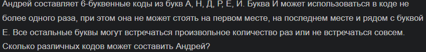
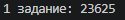
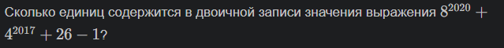
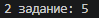
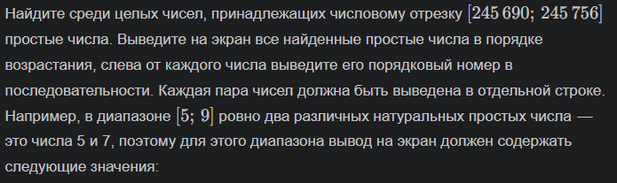
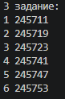

# Отчёт по 2 лабе

## Задание 1
### Условие:



### Проделанная работа:
1. Создан список допустимых букв: `['А', 'Н', 'Д', 'Р', 'Е', 'Й']`
2. Использован `itertools.product` для генерации всех возможных комбинаций длиной 6
3. Реализованы три фильтра:
   - Проверка первого и последнего символа на 'Й'
   - Подсчёт количества 'Й' в комбинации
   - Проверка всех пар символов на недопустимое сочетание 'ЕЙ' или 'ЙЕ'
4. Счётчик увеличивается только для комбинаций, прошедших все фильтры

### Решение:
```python
import itertools

def count_codes():
    letters = ['А', 'Н', 'Д', 'Р', 'Е', 'Й']
    count = 0
    
    for code in itertools.product(letters, repeat=6):
        if code[0] == 'Й' or code[-1] == 'Й':
            continue
        if code.count('Й') > 1:
            continue
        has_invalid_ye = False
        for i in range(len(code) - 1):
            if (code[i] == 'Й' and code[i+1] == 'Е') or (code[i] == 'Е' and code[i+1] == 'Й'):
                has_invalid_ye = True
                break
        if has_invalid_ye:
            continue
        count += 1
    
    return count

print(f'Результат: {count_codes()}')
```

### Результат:


## Задание 2
### Условие:



### Проделанная работа:
1. Упрощено выражение: 26 - 1 = 25
2. Значение переведено в двоичную систему счисления
3. Посчитаны единицы в двоичном числе

### Решение:
```python
n = 8**2020 + 4**2017 + 25
print(f'2 задание: {bin(n).count("1")}')
```

### Результат:


## Задание 3
### Условие:



### Проделанная работа:
1. Определён диапазон: от 245 690 до 245 756
2. Реализована проверка на простоту
3. Заведена переменная count, которая увеличивается при каждом найденном простом числе
4. Каждое простое число выводится в отдельной строке вместе со своим порядковым номером

### Решение:
```python
print('3 задание:')
count = 1
for num in range(245690, 245757):
    if num > 1:
        for i in range(2, int(num**0.5) + 1):
            if num % i == 0:
                break
        else:
            print(count, num)
            count += 1
```
### Результат:


### Источники:
[Itertools в Python - Хабр](https://habr.com/ru/companies/otus/articles/529356/)

[itertools — Functions creating iterators for efficient looping](https://docs.python.org/3/library/itertools.html)

[Итерируем правильно: 20 приемов использования в Python модуля itertools](https://proglib.io/p/iteriruemsya-pravilno-20-priemov-ispolzovaniya-v-python-modulya-itertools-2020-01-03)
