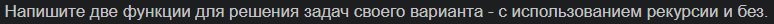
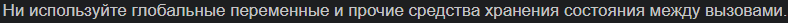
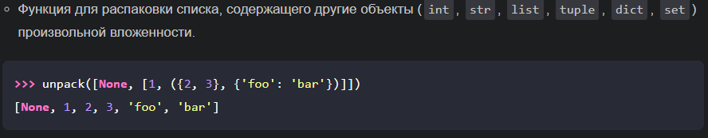
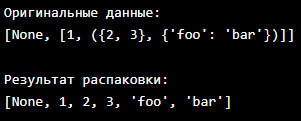
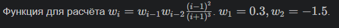
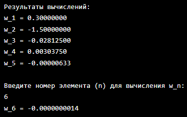

# Отчёт по 3 лабе

## Задание:

## Требования и ограничения:


## Задание 1:

### Условие:

### Проделанная работа:
Были реализованы две функции:

1) Рекурсивная версия unpack_recursive
2) Итеративная версия unpack

Рекурсивная реализация

Функция unpack_recursive обрабатывает вложенные структуры данных с помощью рекурсии:

1) Для каждого элемента проверяет его тип
2) Если элемент является итерируемым (list, tuple, set), рекурсивно распаковывает его
3) Если элемент является словарём, рекурсивно распаковывает его пары ключ-значение
4) Простые элементы (числа, строки, None) добавляются в результат напрямую

Итеративная реализация

Функция unpack использует стек для имитации рекурсии:

1) Помещает итераторы вложенных структур в стек
2) Обрабатывает элементы последовательно, извлекая их из стека
3) При обнаружении вложенной структуры добавляет её итератор в стек
4) Простые элементы добавляются в результат напрямую
### Решение с рекурсией:
```python
def unpack_recursive(iterable):
    result = []
    for item in iterable:
        if isinstance(item, (list, tuple, set)):
            result.extend(unpack_recursive(item))
        elif isinstance(item, dict):
            result.extend(unpack_recursive(item.items()))
        else:
            result.append(item)
    return result
if __name__ == "__main__":
    test_data = [None, [1, ({2, 3}, {'foo': 'bar'})]]
    print("Оригинальные данные:")
    print(test_data)
    
    print("\nРезультат распаковки:")
    unpacked = unpack_recursive(test_data)
    print(unpacked)
```
### Решение без рекурсии:
```python
def unpack(iterable):
    result = []
    stack = [iter(iterable)]
    
    while stack:
        current = stack[-1]
        try:
            item = next(current)
            if isinstance(item, (list, tuple, set)):
                stack.append(iter(item))
            elif isinstance(item, dict):
                stack.append(iter(item.items()))
            else:
                result.append(item)
        except StopIteration:
            stack.pop()
    
    return result
if __name__ == "__main__":
    test_data = [None, [1, ({2, 3}, {'foo': 'bar'})]]
    print("Итеративная распаковка:")
    print("Оригинальные данные:")
    print(test_data)
    
    print("\nРезультат распаковки:")
    unpacked = unpack(test_data)
    print(unpacked)
```
### Ответ:

## Задание 2:

### Условие:

### Проделанная работа:
Были реализованы две функции для расчёта последовательности:

Рекурсивная версия calculate_recursive

Функция вычисляет значения последовательности с помощью рекурсии:

1) Для базовых случаев i=1 и i=2 возвращает начальные значения 0.3 и -1.5 соответственно
2) Для i>2 рекурсивно вычисляет w(i-1) и w(i-2)
3) Применяет заданную формулу к полученным значениям
4) Наглядно отражает математическую формулу, но неэффективна для больших n

Итеративная версия calculate_iterative

Функция использует итеративный подход:

1) Обрабатывает базовые случаи i=1 и i=2
2) Хранит только два предыдущих значения последовательности
3) Последовательно вычисляет элементы в цикле
4) Имеет линейную сложность O(n)
5) Оптимальна по производительности и использованию памяти
### Решение с рекурсией:
```python
def calculate_w_recursive(n):
    if n == 1:
        return 0.3
    elif n == 2:
        return -1.5
    else:
        w_prev_1 = calculate_w_recursive(n - 1)
        w_prev_2 = calculate_w_recursive(n - 2)
        numerator = (n - 1) ** 2
        denominator = (n + 1) ** 3
        return w_prev_1 * w_prev_2 * numerator / denominator
if __name__ == "__main__":
    print("Результаты вычислений (рекурсивная версия):")
    for n in range(1, 6):  # Вычисляем w1-w5
        result = calculate_w_recursive(n)
        print(f"w_{n} = {result:.8f}")  # :.8f - вывод с 8 знаками после запятой
    try:
        user_n = int(input("\nВведите номер элемента (n) для вычисления w_n: "))
        if user_n >= 1:
            user_result = calculate_w_recursive(user_n)
            print(f"w_{user_n} = {user_result:.10f}")
        else:
            print("Число должно быть положительным!")
    except ValueError:
        print("Ошибка: нужно ввести целое число!")
    
    input("\nНажмите Enter для выхода")  # Чтобы окно не закрылось сразу
```
### Решение без рекурсии:
```python
def calculate_w(n):
    if n == 1:
        return 0.3
    elif n == 2:
        return -1.5
    
    w_prev_prev = 0.3  # w1
    w_prev = -1.5       # w2
    
    for i in range(3, n + 1):
        numerator = (i - 1) ** 2
        denominator = (i + 1) ** 3
        w_current = w_prev * w_prev_prev * numerator / denominator
        w_prev_prev, w_prev = w_prev, w_current
    
    return w_prev
if __name__ == "__main__":
    print("Результаты вычислений:")
    for n in range(1, 6):  # Вычисляем w1-w5
        result = calculate_w(n)
        print(f"w_{n} = {result:.8f}")  # :.8f - вывод с 8 знаками после запятой
    try:
        user_n = int(input("\nВведите номер элемента (n) для вычисления w_n: "))
        if user_n >= 1:
            user_result = calculate_w(user_n)
            print(f"w_{user_n} = {user_result:.10f}")
        else:
            print("Число должно быть положительным!")
    except ValueError:
        print("Ошибка: нужно ввести целое число!")
    
    input("\nНажмите Enter для выхода")  # Чтобы окно не закрылось сразу
```
### Ответ:
