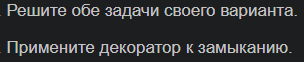
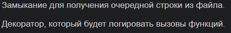
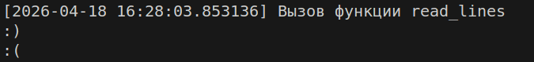

# Отчет по 4 лабе
## Задание:

### Условие:

### Проделанная работа:

1. Реализована функция `read_lines` с использованием замыкания для последовательного чтения строк из файла.
2. Создан декоратор `log_calls`, который логирует вызовы функций с указанием времени вызова.
3. Декоратор применен к функции `read_lines`.

### Решение:
```python
from datetime import datetime
import os

def log_calls(func):
    def wrapper(*args, **kwargs):
        print(f"[{datetime.now()}] Вызов функции {func.__name__}")
        return func(*args, **kwargs)
    return wrapper

@log_calls
def read_lines(file_path):
    if not os.path.exists(file_path):
        print(f"Ошибка: файл {file_path} не найден!")
        return
    
    file = open(file_path, 'r', encoding='utf-8')
        
    def wrapperr(*args, **kwargs):
        return file.readline().strip()
            
    return wrapperr


if __name__ == "__main__":
    file_path = "example.txt"  
    reader = read_lines(file_path)
    

    print(reader())
    print(reader())
```
### Ответ:


### Источники:
[Декораторы Python: пошаговое руководство](https://habr.com/ru/companies/otus/articles/727590/)