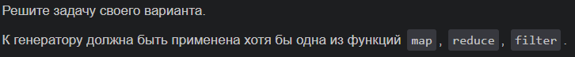
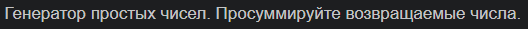
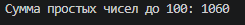

# Отчет по 5 лабе

## Задание:



### Проделанная работа:
1. Создан генератор простых чисел
2. Применена функция reduce для суммирования отфильтрованных простых чисел
3. Выведен итоговый результат — сумма простых чисел

### Решение:
```python
from functools import reduce

def is_prime(n):
    if n <= 1:
        return False
    if n == 2:
        return True
    if n % 2 == 0:
        return False
    for i in range(3, int(n**0.5) + 1, 2):
        if n % i == 0:
            return False
    return True

def prime_generator(limit):
    for num in range(1, limit + 1):
        if is_prime(num):
            yield num

limit = 100
primes = prime_generator(limit)
total = reduce(lambda x, y: x + y, primes, 0)

print(f"Сумма простых чисел до {limit}: {total}")
```
### Ответ:


### Источники:
[Генераторы в Python](https://habr.com/ru/articles/866616/)

[reduce() in Python](https://www.geeksforgeeks.org/python/reduce-in-python/)

[Функция filter () в Python](https://thecode.media/funkciya-filter-v-python/)
